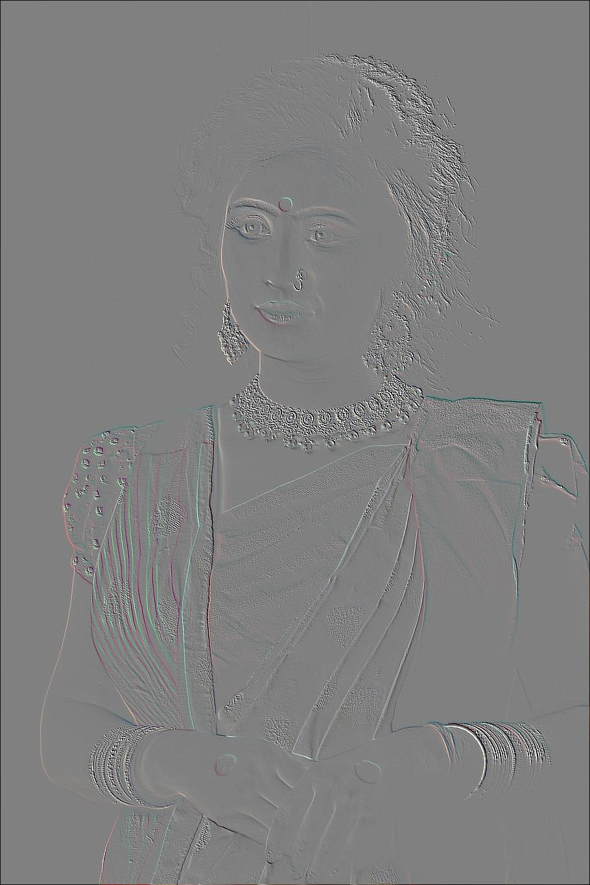
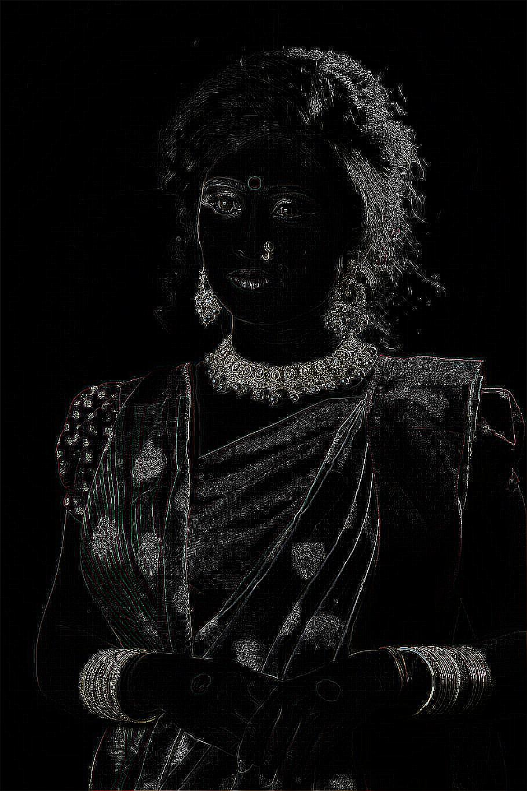

# IMAGE FILTER API <sup>(fast api base)</sup>
     <br>

## # Start up 🐱‍🏍
#### install requirement 
```commandline
pip install -r requirements.txt
```

## # Usage 🚀
#### run  server
```commandline
$ uvicorn main:app --reload
```

#### code example 
```commandline
file = {"image":open("sample.jpg","rb")}
header = {"type":"multypart/image"}
url = "http://127.0.0.1:5000"
filter = "blur"
respo = requests.post("{}/{}".format(url,filter),headers=header, files=file)
respo.raise_for_status

from PIL import Image
import io
image = Image.open(io.BytesIO(respo.content))
image.save("respo1253.jpg","JPEG")
image
```

 insert filter name to 'filter' variable
## # Available filter 📸

### 📷 Blur


<hr >

### 📷 Contour


<hr >

### 📷 Detail


<hr >

### 📷 Edge_enhance


<hr >

### 📷 Edge_enhance_more


<hr >

### 📷 Emboss


<hr >

### 📷 find_edges


<hr >

### 📷 Sharpen


<hr >

### 📷 smooth


<hr >

### 📷 smooth_more


<hr >
